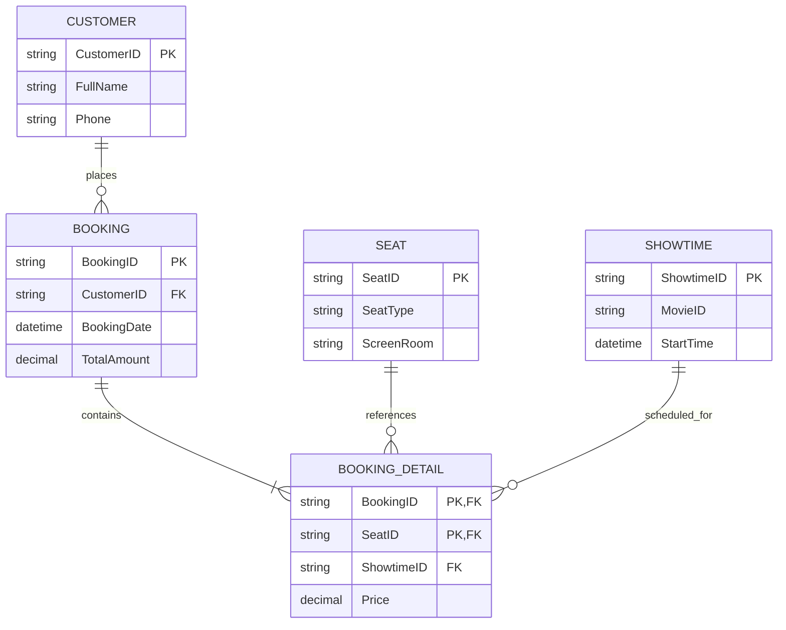

# BÁO CÁO PHÂN TÍCH VÀ THIẾT KẾ XỬ LÝ QUAN HỆ NHIỀU - NHIỀU (MANY-TO-MANY) CHO HỆ THỐNG RIKKEI CINEMA

> 👤 **Học viên:** Đỗ Hoàng Sơn | **Mã SV:** PTIT-HCM-066
> 🏫 **Môn học:** IT105-K25-Phan-tich-thi-t-k-h-th-ng

---

## 📊 Sơ đồ thiết kế hệ thống (Class Diagram)

> 💡 *Sơ đồ dưới đây được render tự động trực tiếp trên GitHub bằng Mermaid. Bạn cũng có thể tải file **`bt3.drawio`** trong repository này để mở và chỉnh sửa trực tiếp trên [Draw.io (diagrams.net)](https://app.diagrams.net).* 

---

## Phần 1: Phân tích điểm nghẽn của quan hệ N-N trực tiếp giữa BOOKING và SEAT

Trong sơ đồ hiện trạng của Rikkei Cinema, việc liên kết trực tiếp N-N giữa 'BOOKING' và 'SEAT' gây ra sự cố 'Double Booking' nghiêm trọng, nghĩa là nhiều khách hàng có thể đặt trùng một ghế trong cùng một thời điểm mà hệ thống không chặn được theo từng Suất chiếu.

Đồng thời, khi thực hiện liên kết trực tiếp như vậy, ta sẽ mất dấu giá vé trong lịch sử. Cụ thể, nếu giá ghế VIP/Standard thay đổi theo thời gian hoặc ghế VIP bị hỏng phải chuyển tạm thành Standard, các hóa đơn vé đã bán trong quá khứ sẽ bị cập nhật theo giá mới trên bảng 'SEAT', vi phạm nguyên tắc toàn vẹn dữ liệu tài chính và kiểm toán.

- Lỗi Double Booking: Thiếu khóa ngoại Suất chiếu ('ShowtimeID') trong quan hệ đặt ghế.
- Mất dấu giá lịch sử: Giá vé phụ thuộc trực tiếp vào bảng 'SEAT' thay vì được đóng băng tại thời điểm giao dịch thành công.

## Phần 2: Thiết kế thực thể trung gian TICKET / BOOKING_DETAIL

Để giải quyết triệt để vấn đề, mình đã phân rã quan hệ N-N thành hai quan hệ 1-N thông qua thực thể trung gian 'BOOKING_DETAIL' (hoặc gọi là 'TICKET'). Thực thể này đóng vai trò lưu giữ thông tin chi tiết từng ghế ngồi trong mỗi đơn đặt vé.

Cấu trúc khóa và các thuộc tính của thực thể trung gian được thiết kế cụ thể như sau:

- Khóa chính (PK): Khóa ghép gồm ('BookingID', 'SeatID').
- Khóa ngoại (FK): 'BookingID' tham chiếu tới bảng 'BOOKING', 'SeatID' tham chiếu tới bảng 'SEAT', và 'ShowtimeID' tham chiếu tới bảng 'SHOWTIME' nhằm đảm bảo một ghế chỉ bị đặt một lần duy nhất cho mỗi suất chiếu cụ thể.
- Cột giá lịch sử: Cột 'Price' (hoặc 'UnitPrice') lưu lại chính xác số tiền khách phải trả tại thời điểm bấm nút xác nhận mua vé, không bị thay đổi bởi biến động giá tương lai.

| Tên cột | Kiểu dữ liệu | Ràng buộc | Mô tả ý nghĩa |
| --- | --- | --- | --- |
| BookingID | VARCHAR(20) | PK, FK | Mã đơn đặt vé |
| SeatID | VARCHAR(10) | PK, FK | Mã ghế ngồi trong phòng chiếu |
| ShowtimeID | VARCHAR(20) | FK | Mã suất chiếu (chống double-booking) |
| Price | DECIMAL(10,2) | NOT NULL | Đóng băng giá vé tại thời điểm mua |

## Phần 3: Đánh giá ràng buộc dữ liệu và Chuẩn hóa cơ sở dữ liệu

Nếu lỡ tay thêm cột 'SeatType' (loại ghế như VIP, Standard, Couple) vào thực thể trung gian 'BOOKING_DETAIL', cột này sẽ vi phạm dạng chuẩn 2NF (Second Normal Form).

Lý do là vì thuộc tính 'SeatType' chỉ phụ thuộc hàm vào 'SeatID' (một phần của khóa chính ghép gồm 'BookingID' và 'SeatID'), chứ không phụ thuộc đầy đủ vào toàn bộ khóa chính. Do đó, 'SeatType' bắt buộc phải được giữ lại ở bảng 'SEAT', thực thể trung gian chỉ nên lưu giá tiền 'Price' áp dụng cho giao dịch đó.

- Vi phạm 2NF: Phụ thuộc một phần vào khóa chính ghép.
- Giải pháp chuẩn hóa: Giữ 'SeatType' ở bảng 'SEAT', bảng 'BOOKING_DETAIL' chỉ lưu giá tiền lịch sử 'Price'.

---

## 📁 Danh sách tệp tin nộp bài trong Repository
- 📝 `bt3.docx`: Báo cáo tài liệu phân tích nghiệp vụ hoàn chỉnh.
- 🎨 `bt3.drawio`: File thiết kế sơ đồ chuẩn theo quy định đề bài (mở trực tiếp bằng [Draw.io](https://app.diagrams.net) hoặc Lucidchart).
